# Simple Blog App with Microservice Architecture.

## **Microservices built with Node, React, Docker and Kubernetes**

**This is what I have built in this project.** 


Problems with the below architecture are-

1. Single point of failure.
2. Scaling is an issue. We have to scale all the databases. It's better to scale the database which needs additional capacity and throughput.


Microservice architecture.


`If service A tries to use the database of service B, then there is the problem, if service B fails then how can service A be able to access the data.` 


---

---

---

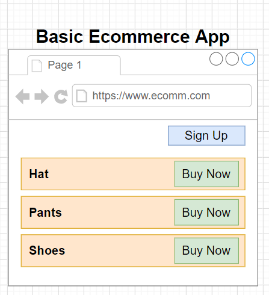

**Monolithic Style Approach.**

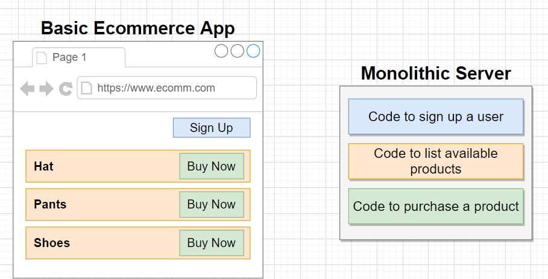


If we added the new feature, then probably we have to fetch all the data to serve that feature. 


### Microservices Architecture.


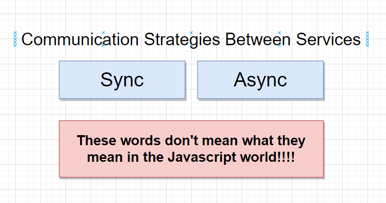


### Implementation of the Async communication

**METHOD 1 :** 

Using the `Event Bus`

Each service contacts the Event Bus and emits the Event or Receives the event. 

Thus, all the services are wired up to the one common thing. Thus we have a single point of failure. Thus whenever we are going to deploy the event bus, we make sure that it should be relatively resilient and reliable. 


Method 2


---

---

# Mini Microservices App


`**npx create-react-app client**`

`npm init -y` to generate the Package.json file

`npm install express cors axios nodemon`


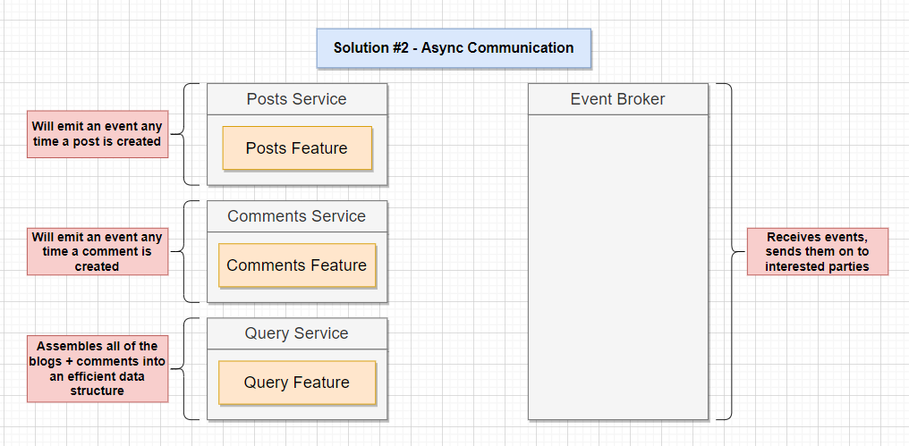


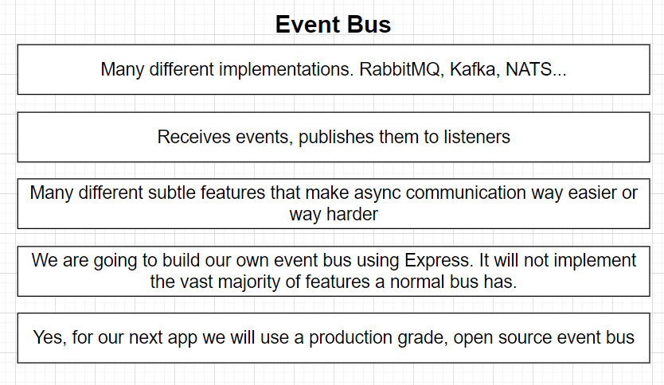


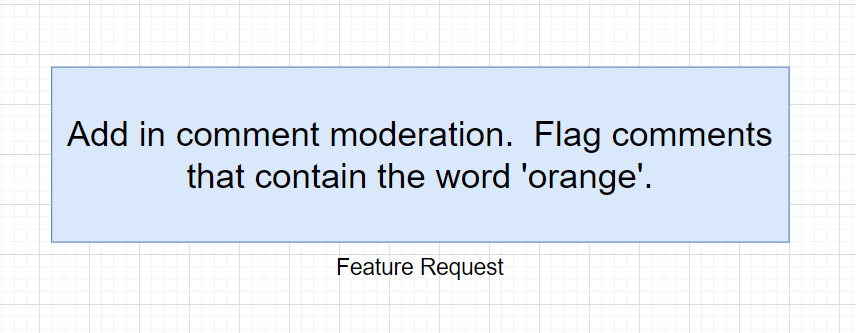

---

---

---

---

---


In Option 1- > The comment is not immediately visible on the screen because after the comment is posted, it first goes to the Moderation service rather than move to the Query Service.   

Therefore there is some delays in this option. 


#Option 3 


# **Orchestrating Collections of services with Kubernetes**

## Running Services with Docker


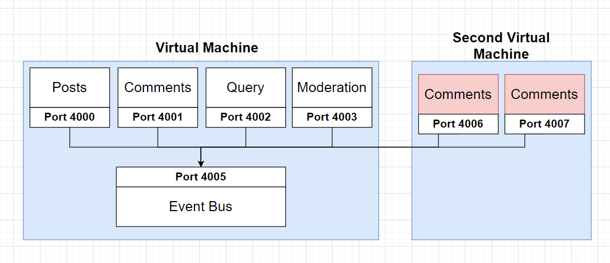


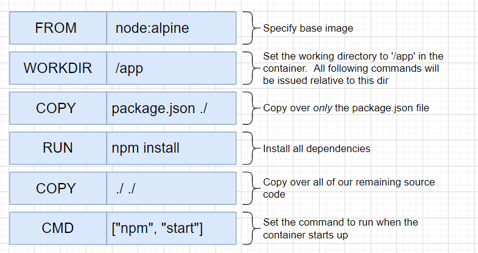


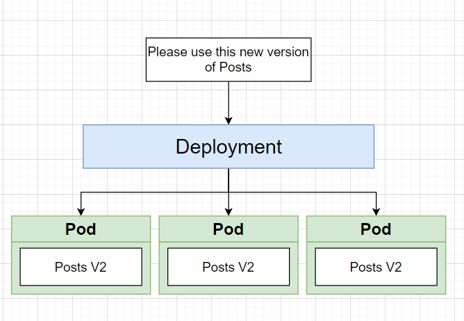

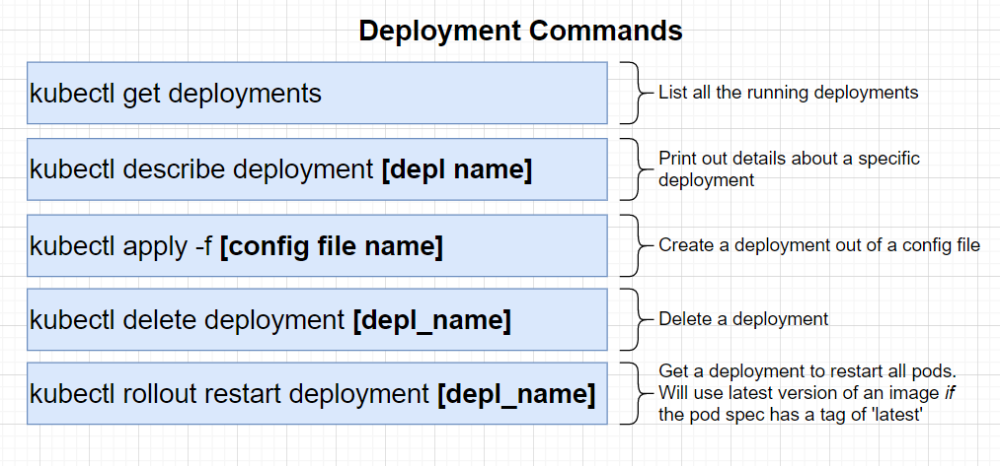


// Node port service


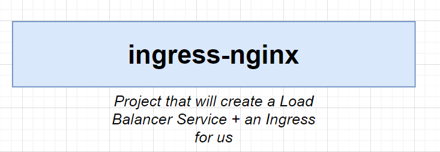

Ingress in Kubernetes

In Kubernetes, there are three general approaches to exposing your application.

- Using a Kubernetes service of type `[NodePort](https://kubernetes.io/docs/concepts/services-networking/service/#type-nodeport)`, which exposes the application on a port across each of your nodes
- Use a Kubernetes service of type `[LoadBalancer](https://kubernetes.io/docs/concepts/services-networking/service/#type-loadbalancer)`, which creates an external load balancer that points to a Kubernetes service in your cluster
- Use a Kubernetes [Ingress](https://kubernetes.io/docs/concepts/services-networking/ingress/) Resource

## **NodePort**

A `NodePort` is an open port on every node of your cluster. Kubernetes transparently routes incoming traffic on the `NodePort` to your service, even if your application is running on a different node.

Every Kubernetes cluster supports `NodePort`, although if you’re running in a cloud provider such as Google Cloud, you may have to edit your firewall rules. However, a `NodePort` is assigned from a pool of cluster-configured `NodePort` ranges (typically 30000–32767). While this is likely not a problem for most TCP or UDP clients, HTTP or HTTPS traffic end up being exposed on a non-standard port.

The `NodePort` abstraction is intended to be a [building block](https://github.com/kubernetes/kubernetes/issues/11690) for higher-level ingress models (e.g., load balancers). It is handy for development purposes, however, when you don’t need a production URL.

## **Load Balancer**

Using a `LoadBalancer` service type automatically deploys an external load balancer. This external load balancer is associated with a specific IP address and routes external traffic to a Kubernetes service in your cluster.

The exact implementation of a `LoadBalancer` is dependent on your cloud provider, and not all cloud providers support the `LoadBalancer` service type. Moreover, if you’re deploying Kubernetes on bare metal, you’ll have to supply your own load balancer implementation. That said, if you’re in an environment that supports the `LoadBalancer` service type, this is likely the safest, simplest way to route your traffic.

## **Ingress Controllers and Ingress Resources**

Kubernetes supports a high level abstraction called *[Ingress](https://kubernetes.io/docs/concepts/services-networking/ingress/)*, which allows simple host or URL based HTTP routing. An ingress is a core concept (in beta) of Kubernetes, but is always implemented by a third party proxy. These implementations are known as ingress controllers. An ingress controller is responsible for reading the Ingress Resource information and processing that data accordingly. Different ingress controllers have extended the specification in different ways to support additional use cases.

Ingress is tightly integrated into Kubernetes, meaning that your existing workflows around `kubectl` will likely extend nicely to managing ingress. Note that an ingress controller typically doesn’t eliminate the need for an external load balancer — the ingress controller simply adds an additional layer of routing and control behind the load balancer.

## Real-world ingress

We’ve just covered the three basic patterns for routing external traffic to your Kubernetes cluster. However, we’ve only discussed how to route traffic to your cluster. Typically, though, your Kubernetes services will impose additional requirements on your ingress. Examples of this include:

- content-based routing, e.g., routing based on HTTP method, request headers, or other properties of the specific request
- resilience, e.g., rate limiting, timeouts
- support for multiple protocols, e.g., WebSockets or gRPC
- authentication

Unless you’re running a very simple cloud application, you’ll likely need support for some or all of these capabilities. And, importantly, many of these requirements may need to be managed at the service level, which means you want to manage these concerns inside Kubernetes.

# **Start with a load balancer**

Regardless of your ingress strategy, you probably will need to start with an `external load balancer`. `This load balancer will then route traffic to a Kubernetes service (or ingress) on your cluster that will perform service-specific routing`. In this set up, your load balancer provides a `stable endpoint (IP address)` for external traffic to access.

Both ingress controllers and Kubernetes services require an external load balancer, and, as previously discussed, NodePorts are not designed to be directly used for production.

# **Service-specific ingress management**

So the question for your ingress strategy is really about choosing the right way to manage traffic from your external load balancer to your services. What are your options?

- You can choose an ingress controller such as [`ingress-nginx](https://github.com/kubernetes/ingress-nginx) or [NGINX kubernetes-ingress](https://github.com/nginxinc/kubernetes-ingress/)`
- You can choose an API Gateway deployed as a Kubernetes service such as [`Ambassador](https://www.getambassador.io/) (built on [Envoy](https://www.envoyproxy.io/) ) or [Traefik](http://traefik.io/).`
- You can deploy your own using a custom configuration of `NGINX, HAProxy, or Envoy.`

Assuming you don’t want to deploy your own, how do you choose between an ingress controller and an API gateway? It comes down to actual capabilities.

So how do you choose between an ingress controller and an API gateway deployed as a Kubernetes service? Surprisingly, there are no fundamental differences!

The original motivation behind ingress was to create a standard API to manage how external traffic is routed to cluster services. However, the reality is that ingress isn’t actually a portable standard. The standard is imprecise (different ingress controllers have different semantics, e.g., behavior of trailing / is not specified in the standard). The ingress standard has also focused on lowest common denominator functionality, so many ingress controllers have extended the ingress resource with custom annotations, creating additional fragmentation.

Kubernetes ingress is a work-in-progress. Organizations appear to be converging on an external load balancer that sends external traffic to a service router `(API Gateway, ingress controller)`. This service router is declaratively configured via Kubernetes annotations.

`Today, NGINX, HAProxy, and Envoy are the most popular proxies powering Kubernetes Ingress Controllers.`


`https://kubernetes.github.io/ingress-nginx/`

`https://kubernetes.github.io/ingress-nginx/deploy/`

`kubectl apply -f https://raw.githubusercontent.com/kubernetes/ingress-nginx/controller-v1.0.0/deploy/static/provider/cloud/deploy.yaml`

# Ingress rules

Each HTTP rule contains the following information:

- An optional host. In this example, no host is specified, so the rule applies to all inbound HTTP traffic through the IP address specified. If a host is provided (for example, foo.bar.com), the rules apply to that host.
- A list of paths (for example, `/testpath`), each of which has an associated backend defined with a `service.name` and a `service.port.name` or `service.port.number`. Both the host and path must match the content of an incoming request before the load balancer directs traffic to the referenced Service.

A defaultBackend is often configured in an Ingress controller to service any requests that do not match a path in the spec.

### **DefaultBackend**

An Ingress with no rules sends all traffic to a single default backend. The `defaultBackend` is conventionally a configuration option of the [Ingress controller](https://kubernetes.io/docs/concepts/services-networking/ingress-controllers) and is not specified in your Ingress resources.

If none of the hosts or paths match the HTTP request in the Ingress objects, the traffic is routed to your default backend.

### **Path types**

Each path in an Ingress is required to have a corresponding path type. Paths that do not include an explicit `pathType` will fail validation. There are three supported path types:

- `ImplementationSpecific`: With this path type, matching is up to the IngressClass. Implementations can treat this as a separate `pathType` or treat it identically to `Prefix` or `Exact` path types.
- `Exact`: Matches the URL path exactly and with case sensitivity.
- `Prefix`: Matches based on a URL path prefix split by `/`. Matching is case sensitive and done on a path element by element basis. A path element refers to the list of labels in the path split by the `/` separator. A request is a match for path *p* if every *p* is an element-wise prefix of *p* of the request path.

    > Note: If the last element of the path is a substring of the last element in request path, it is not a match (for example: /foo/bar matches/foo/bar/baz, but does not match /foo/barbaz).

### 

[Examples](https://www.notion.so/07e545e775874c24b6798e8e0acb6e09)

```yaml
apiVersion: networking.k8s.io/v1
kind: Ingress
metadata:
  name: minimal-ingress
  annotations:
    nginx.ingress.kubernetes.io/rewrite-target: /
spec:
  rules:
  - http:
      paths:
      - path: /testpath
        pathType: Prefix
        backend:
          service:
            name: test
            port:
              number: 80
```

`https://kubernetes.io/docs/concepts/services-networking/ingress/`


`127.0.0.1 [posts.com](http://posts.com)`

When we are connecting to [po](http://pos.co)st.com OS will redirect to local hosts. We are doing this for testing. Not for the production.

 


# Thank You. 😎

## **Contributing**

- Fork it
- Create your feature branch (git checkout -b my-new-feature)
- Commit your changes (git commit -am 'Add some feature')
- Push to the branch (git push origin my-new-feature)
- Create a new Pull Request
